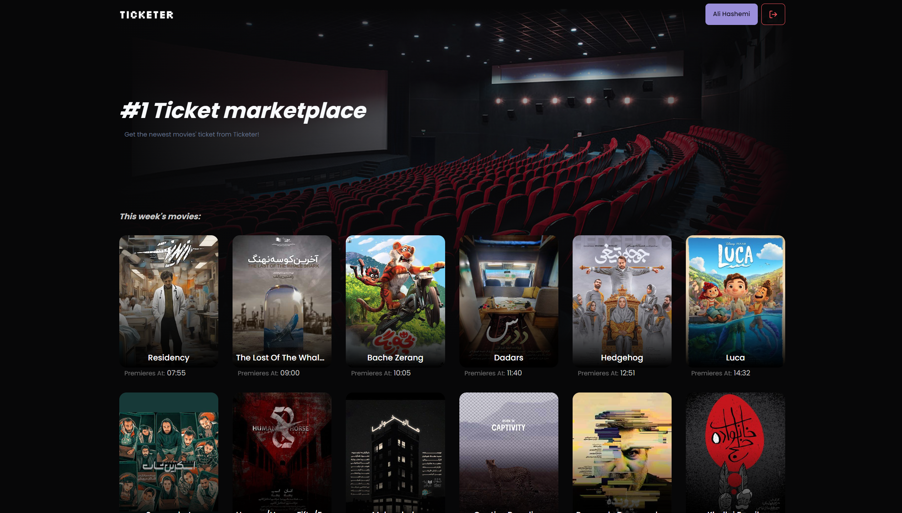

# Ticketer

A dead simple ticket service web app. Made in about a month from scratch as a university project.



> More screenshots are [here](./_screenshots)

## Tech Stack

Ticketer is built on top of these languages, frameworks, and tools:

- Backend:
  - Go
  - iris web-framework
- Frontend:
  - Typescript
  - Sveltekit
- Database:
  - PostgreSQL

## Getting started

To get started deploying Ticketer for whatever reason. You can follow the steps below.

### Requirements:

- Development:
  - [Golang](https://go.dev/)
  - [Postgres](https://www.postgresql.org/)
  - [Node.JS](https://nodejs.org/) + [PNPM](https://pnpm.io/)
- Deployment:
  - [Docker](https://www.docker.com/)

### 1. Update the config file

Take a copy of `config.example.yaml` and rename it to `config.yaml`. then update everything to match with your requirements. (Especially the `jwt_key` field)

### 2. Build and run the project

```bash
docker compose build
docker compose up -d
```

### 3. Mock the database

Ticketer doesn't come with an admin panel or anything like that; it just reads the movies from the database. so you have to add them yourself.

With that said, I already added a few random movies in `sql/mock/movies.sql`. execute it in your database.

You can also see the movie assets used for this sample data in the `static/movie` folder.

```bash
docker exec t-backend /mock
```

### 4. You're done!

Now open up the backend host (`localhost:5552`) in your browser and explore the project!
